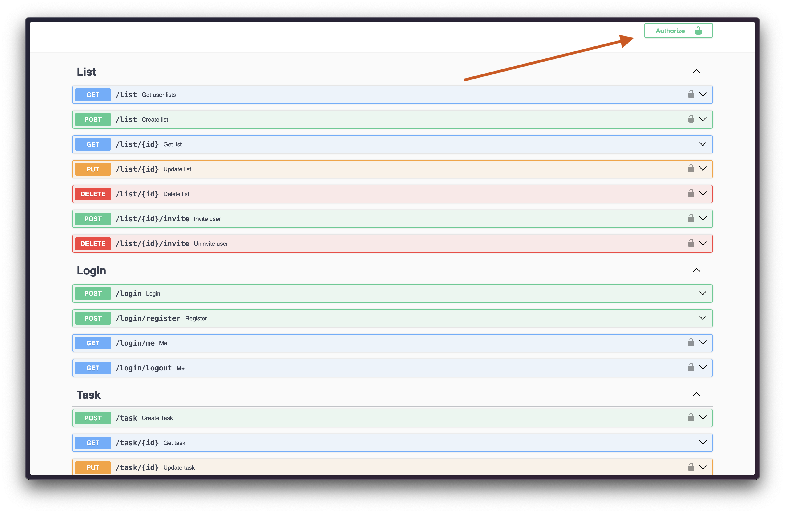

# TODO 

Time spent: [](https://wakatime.com/@jsupa/projects/fhawzgrcnf?start=2024-03-17&end=2024-03-23)

Projekt bol vytvorený s ESM modulmi, pretože som sa chcel naučiť novú technológiu. + je to nový štandard pre node.
Takže to bol freestile projekt, kde som si vyskúšal nové veci ako sú:

- [vinejs](https://vinejs.dev/)
- [tsx](https://github.com/privatenumber/tsx)

Na projekte je swagger dokumentácia, ktorá je dostupná na http://localhost:3001/api-docs

## API:

- 1. krok bude vytvorenie účtu: POST /login/register > vytvorí účet a vráti jwt token
- 2. krok bude zadanie tokenu do swagger Authorized buttonu (vid obrazok)
- 3. krok bude vytvorenie todo listu: POST /list
- 4. krok bude vytvorenie a pridanie todo tasku: POST /task

(Routes bez zámku sú public)



## Installation & Start (pnpm)

```sh
#1st terminal tab
$ docker-compose up
```

```sh
#2nd terminal tab
$ pnpm i
$ pnpm dev
```

Server will be running on http://localhost:3001/api-docs
